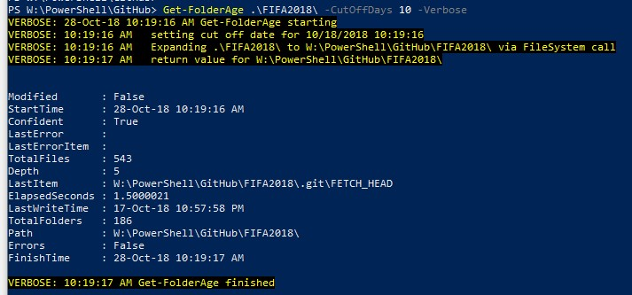

# GetFolderAge

Latest version:

PowerShell script which checks for last modified date _(LastWriteTime)_ for a large number of folders.
It checks recursively for all files and folders inside taking into account potential errors (inaccessible files, too long paths, etc.).

Running a script itself will just import (i.e. create) new commandlet **`Get-FolderAge`** in your session.
It will not do any checks.
You can afterwards run this commandlet with proper parameters as in examples below.

Running commandlet with specifying only a folder name will return last modification time of that folder.
If you specify `-CutOffDate` (or `-CutoffDays`) script will determine if the folder was modified after that time. It will exit folder search as soon as it finds a modified file or folder.

Commandlet can be run in unattended mode also with file output using `-OutputFileName` parameter. Output format is comma-separated value, so file extension should be `.csv`.

Technical explanation of LastModifiedDate can be seen in [this archived copy](https://web.archive.org/web/20110604022236/http://support.microsoft.com/kb/299648) of Microsoft knowledge base article.

## Download

You can download this script in a couple of ways listed below. Execute a script after downloading it (no admin rights needed) to add commandlet `Get-FolderAge` to your session.

- **Download from GitHub:**
You can see online latest script version at this [link](https://github.com/iricigor/GetFolderAge/blob/master/Get-FolderAge.ps1).
The raw PS1 file can be downloaded from [here](https://raw.githubusercontent.com/iricigor/GetFolderAge/master/Get-FolderAge.ps1).

- **Clone repository:**
If you want to see the entire GitHub repository, just clone it

`git clone https://github.com/iricigor/GetFolderAge.git`

- **From PowerShell Gallery** _(preferred way)_:
Script can be downloaded from [PS Gallery](https://www.powershellgallery.com/packages/Get-FolderAge) using the command 

`Save-Script Get-FolderAge -Repository PSGallery -Path 'MyFolder'`

## Help and Examples

### Details

For more examples and full parameter's explanation, run `Get-Help Get-FolderAge -Full` or see the [online version](Get-FolderAge.md).

### Examples

* `Get-FolderAge -Folder '\\server\Docs'`

Returns last modification date of the specified folder.

* `Get-FolderAge -Folder '\\FileServer01.Contoso.com\Users' -TestSubFolders`

Returns last modification date for each user share on a file server.

* `Get-FolderAge -InputFile 'ShareList.txt' -OutputFile 'ShareScanResults.csv' -CutoffDays 3`

Tests if folders listed in specified input file (one folder per line) are modified since "cut-off" 3 days ago. Results are saved to file in csv format.

### Input parameters

Input can be specified in three ways:

* parameter `-FolderName` _(default parameter, can be omitted)_ followed by string or an array of strings specifying paths to be checked
* via pipeline - the same values as above can be passed via pipeline, see the example with `Get-ChildItem`
* parameter `-InputFile` - a file specifying folders to be processed, one folder per line

### Cut-off Date explanation

Cut-off date represents the point in time for which we want to know if a folder was modified after.
Usually, this is the date when last copy or backup or sync was performed on the given folder.

It can be specified as:

* PowerShell [DateTime] object, i.e. the value returned by Get-Date command
* An integer number representing days since last cut-off date (easier, but less precise)

### Output format

Commandlet outputs array of objects. Each object contains these properties:

* [string]`Path` - as specified in input parameters (or obtained subfolder names)
* [datetime]`LastWriteTime` - latest write time for all items inside of the folder
* [bool]`Modified` - if the folder was modified since last cut-off date (or null if date not given)

It also outputs diagnostic/statistics info:

* [bool]`Confident` - if Modified return value is a confident result; in case commandlet is called with QuickTest switch, return value for Modified might not be correct.
* [int]`TotalFiles` - total number of files and directories scanned
* [int]`TotalFolders` - total number of directories scanned
* [string]`LastItem` - an item with the latest timestamp found (note that this might not be really the latest modified file. If this timestamp is newer than CutOffDate, commandlet will not search further.
* [int]`Depth` - total depth of scanned folders relative to initial folder. If QuickTest, then it will be 1, regardless of real depth. If CutOffDate specified, it might not go to full depth, so this number will be smaller than full depth.
* [decimal]`ElapsedSeconds` - time spent in checking the folder
* [datetime]`FinishTime` - date and time when folder check was completed
* [bool]`Errors` - indicate if command encountered errors during its execution (i.e. Access Denied on some file)
* [string]`LastError` - text of the last encountered error

### Restartable script

Parameter `-OutputFile` specifies where output data is stored on the disk.
If the script is interrupted before finishing, you can restart it without a need to process same folders again.
Just specify the same `-OutputFile` and `-InputFile` and script will skip already processed folders!

This is especially useful for long running scripts.

## Build status

Each commit or PR to master is checked on [Azure DevOps](https://azure.microsoft.com/en-us/services/devops/) [Pipelines](https://azure.microsoft.com/en-us/services/devops/pipelines/) on two build systems:

1. Ubuntu **Linux** v.16.04 LTS running PowerShell (Core) v.6.1 
2. **Windows** Container running Windows PowerShell v.5.1 

## Support

You can chat about this commandlet via [Skype](https://www.skype.com) _(no Skype ID required)_, by clicking a link below.

## Contributing

If you find any problems, feel free to open a new issue.

If you want to contribute, please fork the code and make a new PR after!

